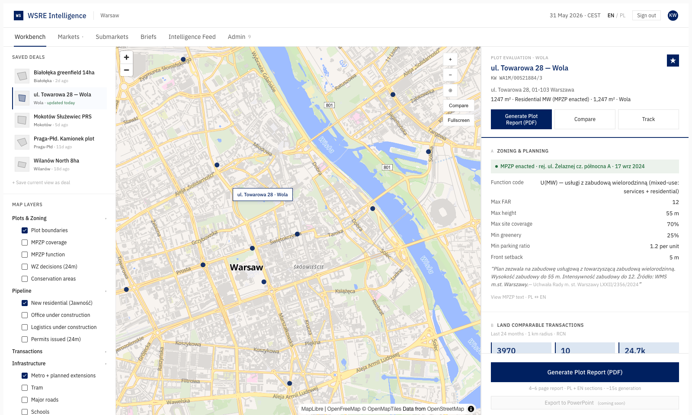

# WSRE Intelligence — Warsaw

> Real estate market intelligence for Poland, built on the world's most transparent primary-market apartment pricing feed.

## What This Is

WSRE Intelligence is an agentic real estate intelligence platform for the Warsaw market. It ingests Poland's statutory *Jawność cen mieszkań* primary-market pricing feed, queries live Warsaw municipal zoning data, synthesises weekly research briefs via Claude Opus, and provides Warsaw-area developers, foreign capital, and asset managers with a unified workbench for plot-level underwriting decisions.

## The Wedge

In July 2025 Poland passed *Ustawa o jawności cen mieszkań* — a transparency law requiring every primary-market real estate developer to publish daily, machine-readable XML files of every apartment price, every price change, and every reservation status. Approximately 1,000 developers nationally, 200+ in Warsaw alone, all publishing daily, by law. The data is free, CC0-licensed, machine-readable. And it's nearly invisible — schema variations across developers, all in Polish, the government portal essentially unusable.

WSRE Intelligence is the canonical interpretive layer over this data. Foreign capital cannot access it without a Polish team. Polish developers cannot measure their competitors at this granularity without a dedicated analyst team. The platform productises both use cases.

## Project Origin and Fork Disclosure

**This Warsaw platform is a fork of an earlier Saudi Arabia version of the same architecture, also built by Karol Wojcik for CS 153.**

The Saudi version — *WSRE Intelligence — Riyadh Industrial* — served the MODON Riyadh 1 industrial city use case for my role at White Star Real Estate. I pivoted to Warsaw mid-course after identifying that the Polish data landscape was significantly richer than the Saudi equivalent. Specifically:

- The *Jawność cen mieszkań* feed has no Saudi equivalent — Poland is one of the only major markets globally with mandatory daily primary-market price publication
- Warsaw municipal GIS (BGiK) exposes the full enacted zoning catalogue as a documented public API
- Polish trade press (Eurobuild CEE, inwestycje.pl) provides high-density, English+Polish coverage that the Saudi equivalent lacks
- The pending FINN bill (Polish REIT-equivalent legislation) creates a 12–24 month first-mover window before international REIT vehicles enter the market

The pivot to Warsaw allowed the platform to demonstrate substantially more sophisticated data integration than the Saudi version permitted.

Both projects represent my own continuous engineering work. The Warsaw version inherits approximately 70% of the architecture from the Saudi version (API patterns, brief synthesis pipeline, news ingestion framework, frontend component library, Postgres schema patterns), with the remaining 30% representing Warsaw-specific original work. See [AI_DISCLOSURE.md](./AI_DISCLOSURE.md) for full disclosure on what was human-driven vs. AI-assisted.

**Warsaw-specific original work includes:**

- Complete *Jawność cen mieszkań* ingestion pipeline (16,175 datasets discovered, 85,130 dwelling rows in Postgres across 1,351 developers)
- Warsaw BGiK WMS integration with custom MapLibre raster tile protocol for live MPZP zoning overlays
- Polish-language news scraping (Eurobuild CEE + inwestycje.pl) with Haiku-triage + Sonnet-extraction pipeline producing 456 typed facts across 8 fact tables
- Plot Evaluation Workbench with 9 distinct sections (zoning, comps, exit pricing, competing supply, demographics, infrastructure, regulatory, intelligence, underwriting)
- Section I underwriting model with function-aware build cost resolution and blended exit pricing for U(MW) mixed-use plots
- POI ingestion from OpenStreetMap Overpass API across 6 categories (5,804 POIs total)
- PostGIS spatial joins for canonical Warsaw 18-dzielnica district resolution
- Polish/English language toggle with 30-key translation dictionary
- Compare mode for side-by-side plot evaluation
- Warsaw-specific brief synthesis prompt with Polish RE editorial voice

## Quick Facts

| Metric | Value |
|--------|-------|
| Dwelling rows in Postgres | 85,130 |
| *Jawność* datasets discovered | 16,175 |
| Developers with data | 1,351 |
| Warsaw investments tracked | 1,301 |
| Warsaw districts with pricing data | 15 of 18 |
| POIs (schools, healthcare, parks, transit) | 5,804 |
| Typed RE facts across 8 fact tables | 456 |
| News articles processed by AI pipeline | 134 |
| Backend migrations | 23 |
| Weekly brief cost (Claude Opus) | ~$0.65 |
| Total build time, solo | 6 weeks |

## Architecture

See [ARCHITECTURE.md](./ARCHITECTURE.md) for system architecture, data flow diagram, and component overview.

## Setup & Reproducibility

See [CONTRIBUTING.md](./CONTRIBUTING.md) for local setup instructions. Full reproduction of WMS layers requires a Polish IP address or VPN; the Plot Evaluation demo works without it.

## AI Tool Usage Disclosure

This project was developed with extensive use of Claude (Anthropic) tools. Full disclosure in [AI_DISCLOSURE.md](./AI_DISCLOSURE.md).

## Limitations & Known Issues

See [LIMITATIONS.md](./LIMITATIONS.md) for full discussion of data coverage gaps, technical debt, deployment constraints, and documented failure analysis.

## License

MIT License. See [LICENSE](./LICENSE).

## Author

Karol Wojcik
Stanford GSB MBA 2026
CS 153 — Frontier Systems, Spring 2026
Built for the One-Person Frontier Lab project
